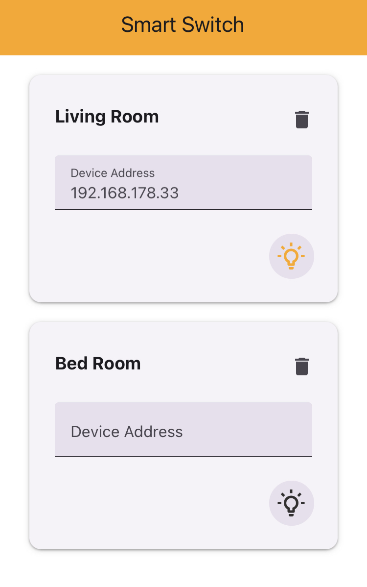

# Welcome to Smart-Switch

## Overview

  

Experience the future of home automation with our revolutionary Smart-Switch. This innovative device empowers you with seamless control over your lighting, offering unparalleled convenience and energy efficiency. Whether you're at home or halfway across the world, the Smart-Switch gives you the power to transform your environment with a simple tap.

## Features

- **Global Remote Control**: Manage your lights from anywhere on the planet. Turn them on or off remotely, even when you're continents away.

- **Real-time Status**: Stay connected to your space. Monitor the status of your switches to ensure lights are off when needed and conserve energy effortlessly.

- **Effortless Timers**: Embrace automation by setting timers to adjust lighting levels. Create the perfect ambiance and save energy with ease.

## Applications

The Smart-Switch opens up a world of possibilities:

- **Energy Efficiency**: Contribute to a greener planet and lower your bills by utilizing scheduled timers for optimal energy consumption.

- **Elderly Comfort**: Provide seniors with easy access to lights, enhancing their independence and security.

- **Child-Friendly**: Empower children to control their environment safely and responsibly, promoting comfort and learning.

- **Remote Parenting**: Monitor and manage your children's room lighting, ensuring their comfort even when you're away.

- **Effortless Elegance**: Simplify your daily routine and elevate your lifestyle with seamless, remote control.

## Getting Started

1. Affix the Smart-Switch to your existing light switch.
2. Open the Smart-Switch app and enter your WiFi credentials.
3. Begin enjoying remote control and energy-saving benefits.

## Contribution

We welcome contributions to make the Smart-Switch even better. Please fork this repository, make your enhancements, and submit a pull request.

## Contact

For inquiries and support, please email us at support@smart-switch.com or visit our website at khallad_3@hotmail.com

Elevate your space, conserve energy, and embrace the future of illumination with the Smart-Switch. It's time to take command and experience a new level of convenience.
